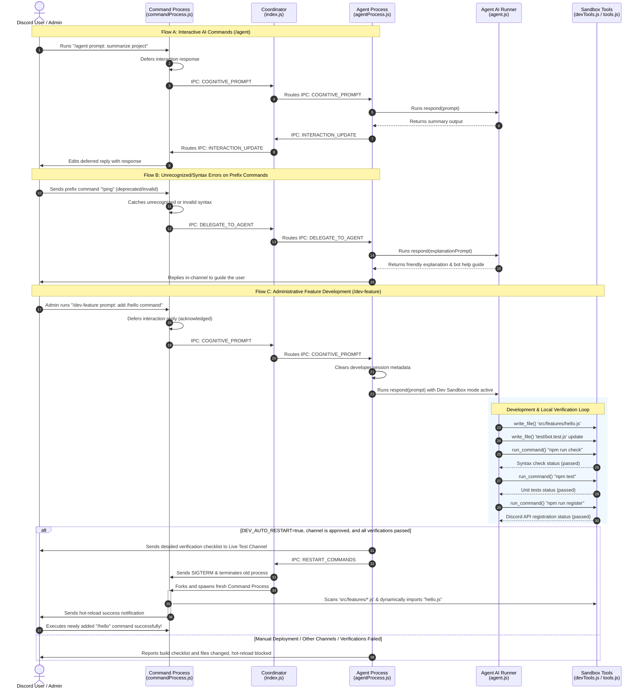
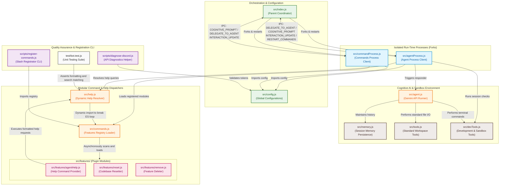

# Discord-Driven Feature Workflow & Architecture

This document describes the parent-child multi-process architecture, dynamic hot-reloading pipeline, and developer sandbox rules for the Discord Agent Bot. It serves as an authoritative guide on how processes, code modules, and live environments coordinate.

---

## 1. Sequence Diagram: Dual-Process & Dev-Feature Workflow

This sequence diagram illustrates the lifecycle of bot commands, detailing how conversational queries, unrecognized prefix errors, and administrative developer prompts are routed via the Coordinator and hot-reloaded dynamically upon verification.



---

## 1.1 Auto-Restart Policy

Feature modules under `src/features/` are loaded by the Command Process. After `/dev-feature` writes or changes a feature, the Agent Process must request a Command Process restart so the new module is imported.

Auto-restart is controlled by environment variables:

```env
DEV_AUTO_RESTART=true
DEV_AUTO_RESTART_CHANNEL_IDS=1148922537540071478
```

Rules:

- Auto-restart happens only after `npm run check`, `npm test`, and `npm run register` pass.
- Auto-restart happens only for admin-approved `/dev-feature` requests.
- If `DEV_AUTO_RESTART_CHANNEL_IDS` is empty, any channel can trigger auto-restart.
- If `DEV_AUTO_RESTART_CHANNEL_IDS` has values, only those channel IDs can trigger auto-restart.
- The restart is an internal hot reload of `src/commandProcess.js`, not a full `npm start` restart.

Expected successful flow:

```text
/dev-feature prompt: add /hello command
agent writes src/features/hello.js
agent writes test/hello.test.js
agent runs npm run check
agent runs npm test
agent runs npm run register
agent sends RESTART_COMMANDS to Coordinator
Coordinator kills and respawns Command Process
new /hello command works without manually running npm start
```

If a full process restart is still required, it means the change touched the Coordinator, Agent Process, package dependencies, or environment configuration. Command Process hot reload only applies to command modules and command-side runtime files.

---

## 2. File Dependency & Connection Diagram

This system diagram displays the layout of the project directories, detailing how files connect, inherit properties, communicate over the Process Inter-Process Communication (IPC) bridge, and break circular dependencies at runtime.



---

## 3. Safe Developer Sandbox Rules

The developer agent runs within a strictly sandboxed local environment. It enforces the following access controls to guarantee that core bot operations and credentials remain secure during dynamic iterations:

- **Allowed Directories** (The agent has full read/write permission):
  - `src/` (Specifically writing self-contained files under `src/features/` to scale capabilities)
  - `scripts/` (Scripts related to CLI utilities)
  - `test/` (Adding modular test suites under `test/` for new features)
  - `README.md`
  - `Workflow.md`
  - `package.json`

- **Blocked Paths** (Access is strictly denied immediately):
  - `.env` (Protects your active Discord token and Gemini API key from exposure)
  - `node_modules/` (Maintains standard local dependency locks)
  - `data/` (Protects conversation history and database sessions)
  - `agent_workspace/`
  - `package-lock.json`

- **Allowlisted Verification Commands**:
  - `npm run check` (Runs static syntax checks on index, scripts, and feature files)
  - `npm test` (Executes the local automated test runner)
  - `npm run register` (Synchronizes registered command payloads with the Discord REST API)
  - `npm audit` (Runs vulnerability assessments)
  - `docker compose build` (For deployment container layers)

---

## 4. Feature Implementation Rules

When developing a new feature for the bot, follow these module guidelines:

1. **Independent Self-Contained Files**:
   - Write your command as a single, modular file under `src/features/` (e.g. `src/features/myFeature.js`).
   - Do **NOT** manually edit `commands.js`, `commandProcess.js`, or `help.js` to register it. They use runtime automatic loaders and resolver pathways.

2. **Standard Structure**:
   - Every feature module must export a `feature` constant with the following properties:
     - `data`: A `SlashCommandBuilder` metadata payload.
     - `execute(interaction)`: Slash interaction handler.
     - `executePrefix(message, args)`: Optional message prefix handler.
     - `help`: A help documentation entry object.

### Example Template:
```javascript
import { SlashCommandBuilder } from 'discord.js';

export const feature = {
  data: new SlashCommandBuilder()
    .setName('hello')
    .setDescription('Say hello!'),

  async execute(interaction) {
    await interaction.reply('Hello!');
  },

  help: {
    name: '/hello',
    aliases: ['!hello'],
    usage: '/hello',
    description: 'A friendly greeting.',
    examples: ['/hello']
  }
};
```
